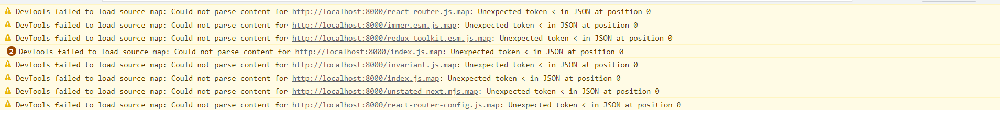
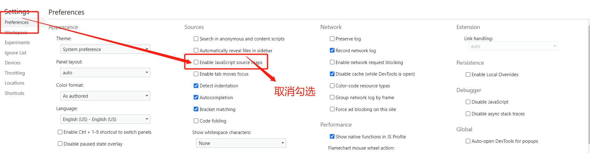

# WIS-ui React

UI组件参考 [Ant Design Pro](https://pro.ant.design).

## 项目初始化

Install `node_modules`:

```bash
npm install
```

or

```bash
yarn
```

<!-- ## Provided Scripts

Ant Design Pro provides some useful script to help you quick start and build with web project, code style check and test.

Scripts provided in `package.json`. It's safe to modify or add additional script: -->

### 启动项目

```bash
yarn start
```

### 构建项目

```bash
yarn build
```

### 关闭 Source map 警告提示



<!-- ### Check code style

```bash
npm run lint
```

You can also use script to auto fix some lint error:

```bash
npm run lint:fix
```

### Test code

```bash
npm test
```

## More

You can view full document on our [official website](https://pro.ant.design). And welcome any feedback in our [github](https://github.com/ant-design/ant-design-pro). -->
